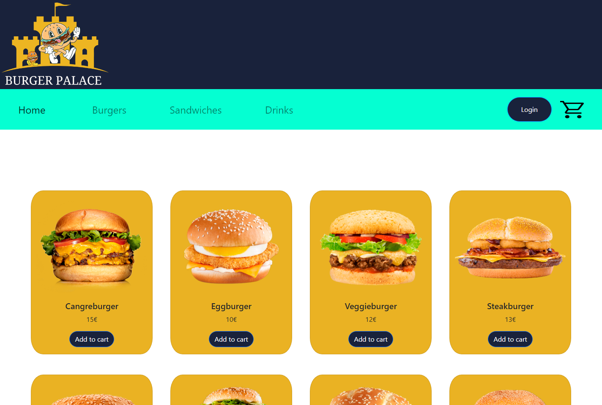

# BurgerPalace 🚀

This is our event management app. Admins can add/remove/edit events and users can subscribe/unsubscribe to attend them.

**Link to project:** 
FrontEnd: https://github.com/checkmyprojects/burgerpalace-frontend
Backend: https://github.com/checkmyprojects/burgerpalace-backend
## How It's Made:
---

**Tech used 🛠️:** Java, Spring, Angular 13, HTML, CSS, Typescript, Bootstrap, MySQL

With Springboot to power our fullstack app, we made a responsive website for a restaurant that offers food online.

Our goal is to offer a way of eating at home delicious cooked meals without worrying about the process itself. We cook for you!

This was our first project using Angular and we are still learning how it works but we hope you like our project.
This is a screenshot of our project:
 

On this project we have worked with agile development through Scrum and Kanban. We've done four sprints, dividing our user stories on each week. We are well organized and have a nice time working together as a team.
 

## Team
---

Hi there!

We are a group of enthusiastic coders excited about web-designing. On our latest project we have created a web-page for an online food order service.

- Iris: https://github.com/irisvilaseca Scrum Master/developer
- Jesús: https://github.com/checkmyprojects Developer
- Carlos: https://github.com/CarlitosHunter Product Owner/developer

## Lessons Learned:
---

Angular helps on developing dynamic websites while working on single components and separate features at the same time! It makes the developing process easier.
We have used for the first time JWT on Angular to work on the security function (signup, login and authorizations).

